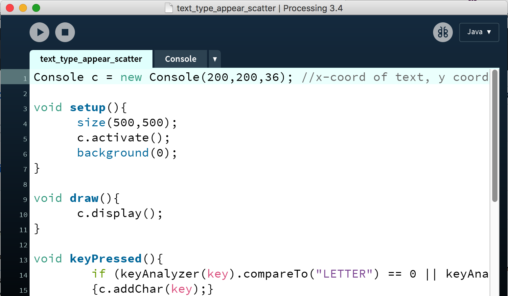

# Example of how to take text input from user and display on screen with Processing (Java)

The easiest way to use this is to download the .zip folder.
Both .pde files work together (need to be open as tabs in same sketch) The main sketch is 'text_type_appear_scatter' and the second one is a class called 'Console'.
Your window should look like this:

