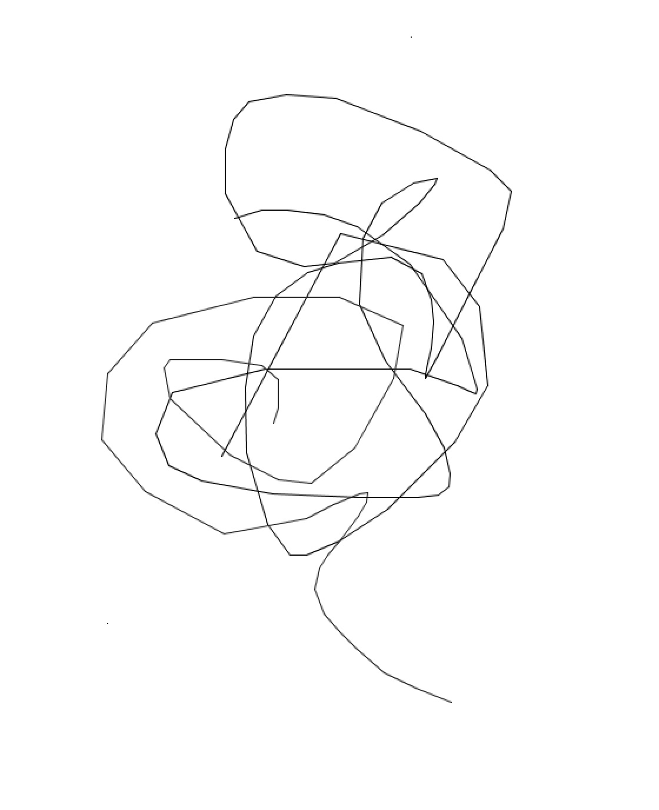

<strong>CreativeCoding_2019: WEEK 1</strong>
Introduction to Processing.

Here are the sccreenshots of two sketches we worked through showing both continuous line — using `line (mouseX, mouseY, pmouseX, pmouseY);` and the continuous rainbow circles.

See the sketches in the directory above (end in .pde).

