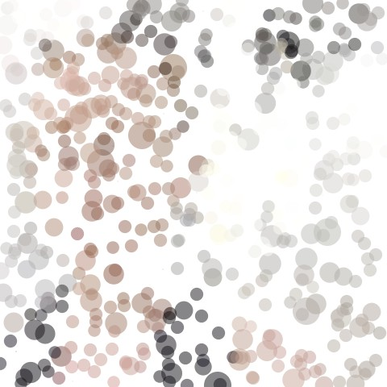
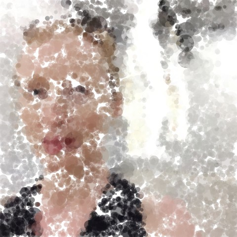

# Week_2 

Well we made it through the second week and we are still going steep up that learning curve with our eyes on a small plateau that will come into focus soon.

Today we covered a number of important coding elements as well as a couple of specific-to-Processing functions.
We were introduced to methods with which Processing can add, display and manipulate an image, and also how to load in a font or use the system fonts to write with Processing, more work on both of these next week.

New vocabulary to note: 
  `PImage` 
  `imageMode(CENTER)` 
  `PFont` 
  `color` eg: `color pix = photo.get (x,y);` 
  `float` 
  `map` 
  `String` 
  `createFont()` 
  `loadFont()` 
  `textFont()` 
  `.length`  eg. `someString.length` 
  `.charAt()` eg. `someString.charAt()` 
  `for (int i = 0; i < limit; i++) {  }` 
 
  ## Pointillizer
    
  We all made a "Pointillizer" sketch in Processing which slowly fills the canvas with coloured dots, slowly making up our own portrait. The dots were larger or smaller depending on how we position our mouse across the X axis (using the 'map' function).  

An interesting derivation of the pointillize sketch (using triangles rather than ellipses) can be seen at the base of the work <href= "http://www.kultur.design/portfolio/dead-presidents/" >Dead Presidents.</a>
